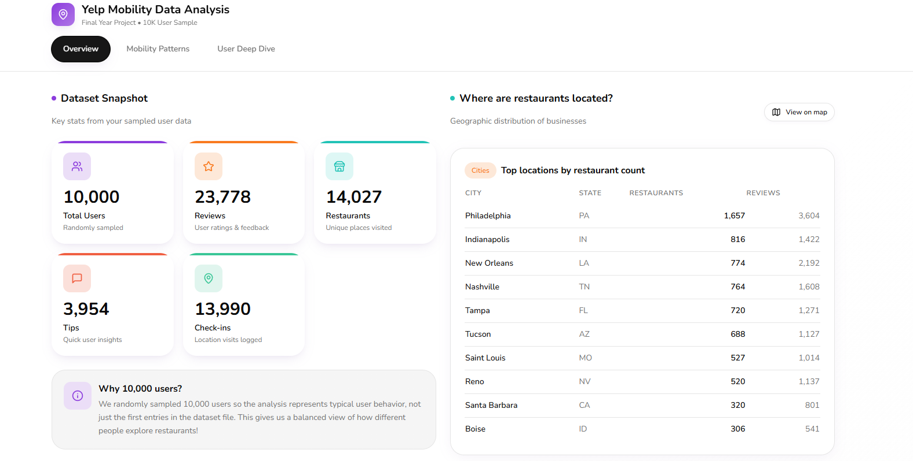

# Mobility-Aware Restaurant Recommendation Demo (FYP)

This repository contains the demonstration dashboard developed for my Final Year Project on **mobility-aware restaurant recommendation using Yelp data**. It is designed to communicate the key ideas, methodology, and findings of the project through an interactive web interface.

The demo focuses on how **user dining mobility patterns** can be profiled from historical restaurant interactions and how these patterns can support more geographically realistic recommendation behavior.



---

## Project Overview

Traditional recommender systems often model user preference primarily from historical interactions, while giving limited attention to whether a recommended item is geographically realistic for the user. In the restaurant domain, this is an important limitation, since dining choices are strongly influenced by location and travel behaviour.

This project investigates whether restaurant recommendation can be improved by explicitly modelling **user mobility**. Using processed Yelp interaction data, users are profiled according to their spatial dining behaviour, and these mobility signals are incorporated into a retrieval-oriented recommendation pipeline.

This demo serves as the presentation layer of the project. It allows viewers to explore the processed dataset, inspect user mobility patterns, and understand the motivation behind mobility-aware recommendation design.

---

## What the Demo Shows

### 1. Dataset Overview
The dashboard presents a summary of the processed Yelp sample used in the project, including:
- number of users
- number of restaurant businesses
- number of reviews
- number of tips
- number of check-ins

It also includes high-level geographic summaries such as city and state coverage to give context on the spatial distribution of the data.

### 2. Mobility Profiling
User restaurant visits are clustered using **DBSCAN with haversine distance** in order to identify meaningful dining hubs. Based on these clusters, users are grouped into interpretable mobility types such as:

- **One-area users**: users whose dining activity is concentrated within a single local area
- **Two-area commuters**: users whose activity reflects two distinct hubs, such as home and workplace regions
- **Explorers**: users whose dining behaviour is spread across multiple or wider-ranging areas

The dashboard highlights:
- the proportion of users in each mobility category
- average hub separation for two-hub users
- typical within-hub travel range
- summary indicators that help interpret whether the extracted mobility structure is plausible

### 3. Research Interpretation
The interface also includes research notes to explain the modelling choices behind the project, including:
- why DBSCAN was selected for hub detection
- why haversine distance is used for geospatial clustering
- how `eps` was selected through k-distance analysis
- why centroid-only location representations may fail for multi-hub users

---

## Research Motivation

A single geographic centroid is often sufficient for users whose behaviour is tightly concentrated in one area. However, a meaningful subset of users exhibit **multi-hub mobility**, where restaurant visits are distributed across distinct regions. In such cases, a single centroid may fall into an “in-between” location that the user does not meaningfully visit, leading to geographically implausible recommendations.

The key motivation of this project is therefore to treat restaurant recommendation not only as a preference-learning problem, but also as a **geographically constrained retrieval problem**.

---

## Role of This Demo in the FYP

This repository is a **demo and visualisation layer** for the Final Year Project rather than the full experimental pipeline.

The core research workflow, including:
- preprocessing Yelp interaction data
- restaurant-only business filtering
- sequence construction
- mobility profiling
- candidate retrieval
- leave-one-out evaluation
- baseline comparison

is performed offline using Python and notebook-based experiments. The outputs are then exported into structured JSON and CSV files for use in this web demo.

This frontend is intended to help communicate the project in a more accessible and interactive form during demonstrations, presentations, and report discussions.

---

## Tech Stack

- **React**
- **TypeScript**
- **Tailwind CSS**
- **lucide-react**
- **shadcn/ui**
- **PapaParse** for CSV parsing
- local file loading from `/public/data/*`

---

````md
## Data Files

Place the following files in:

```bash
public/data/
````

### Required files

* `mobility_summary.json`
* `user_mobility_table.csv`

### File descriptions

#### `mobility_summary.json`

Contains the aggregated statistics used by the dashboard summary cards and charts.

#### `user_mobility_table.csv`

Contains per-user mobility outputs for inspection and future deeper interaction features.

---

## Getting Started

### 1. Install dependencies

```bash
npm install
```

### 2. Run locally

```bash
npm run dev
```

Then open the local URL shown in the terminal, typically:

```bash
http://localhost:5173
```

### 3. Build for production

```bash
npm run build
```

---

## Project Structure

```bash
src/
  components/
    dashboard/
      MobilityTab.tsx
  hooks/
    useMobilityData.ts
  data/
    dashboardData.ts
public/
  data/
    mobility_summary.json
    user_mobility_table.csv
```

### Important files

#### `MobilityTab.tsx`

Main dashboard view for presenting mobility-related analysis.

#### `useMobilityData.ts`

Custom hook for loading and parsing local JSON/CSV data files.

#### `dashboardData.ts`

Fallback or mock visualisation data used during development.

---

## How Data Is Loaded

The dashboard uses a custom hook:

```ts
import { useMobilityData } from "@/hooks/useMobilityData";
```

This hook:

* loads the JSON summary file into the dashboard summary model
* loads the CSV file and parses row-level mobility outputs
* prepares the data for rendering in cards, tables, and future detailed exploration views

---

## Author

**Lim Jing Jie**
Final Year Project
**Mobility-Aware Restaurant Recommendation Using Yelp Data**

---

## Disclaimer

This repository contains the interactive demo interface for presenting the project findings. It is not the complete research codebase. The main clustering, preprocessing, recommendation, and evaluation pipeline is executed separately offline, with results exported for visualisation in this application.
